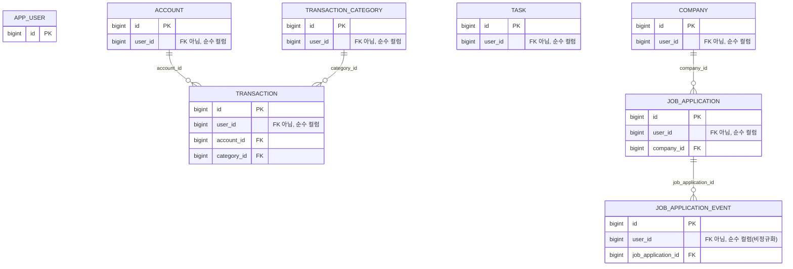

# 테이블 정의서

lifehub-api의 전체 DB 스키마 문서입니다. 실제 Flyway 마이그레이션
(`src/main/resources/db/migration/V1~V4`)과 JPA 엔티티(`src/main/java/com/lifehub/**/entity`)를
기준으로 작성되었습니다. DB(Postgres)가 진실의 원천(source of truth)이며, 엔티티는 이를
따라갑니다(`spring.jpa.hibernate.ddl-auto=validate`).

> 새 테이블이 추가되거나 기존 테이블 컬럼이 바뀌면 이 문서도 함께 갱신합니다.

## 목차

1. [전체 관계 개요](#전체-관계-개요)
2. [공통 설계 원칙](#공통-설계-원칙)
3. [app_user](#app_user) — V1
4. [account](#account) — V2
5. [transaction_category](#transaction_category) — V2
6. [transaction](#transaction) — V2
7. [task](#task) — V3
8. [company](#company) — V4
9. [job_application](#job_application) — V4
10. [job_application_event](#job_application_event) — V4

---

## 전체 관계 개요

`app_user`는 다이어그램에 있지만 **다른 어떤 테이블과도 실제 FK로 연결되어 있지 않습니다**
(아래 "공통 설계 원칙" 참고). `task`, `company`도 다른 도메인 테이블을 FK로 참조하지 않는
독립 테이블입니다.

| 부모 | 자식 | FK 컬럼 | ON DELETE |
|---|---|---|---|
| `account` | `transaction` | `transaction.account_id` | 제약 없음 (앱에서 참조 존재 시 삭제 차단) |
| `transaction_category` | `transaction` | `transaction.category_id` | 제약 없음 (앱에서 참조 존재 시 삭제 차단) |
| `company` | `job_application` | `job_application.company_id` | 제약 없음 |
| `job_application` | `job_application_event` | `job_application_event.job_application_id` | 제약 없음 |

모든 FK에 `ON DELETE`를 지정하지 않았습니다(기본값: `NO ACTION`). 참조 중인 하위 레코드가
있는 상위 레코드를 삭제하려 하면 DB가 거부합니다. `account`/`transaction_category`는
서비스 레이어에서도 미리 존재 여부를 확인해 `409 Conflict`로 더 친절하게 막습니다
(자세한 내용은 [기능정의서](./feature-specification.md) 참고). `company`/`job_application`은
아직 API가 구현되지 않아 이 가드도 아직 없습니다.

## 공통 설계 원칙

### 모든 테이블에 `user_id`가 있지만, `app_user`로의 FK가 아니다

각 테이블의 `user_id BIGINT NOT NULL`은 **일반 컬럼**일 뿐, `REFERENCES app_user (id)` FK
제약이 걸려 있지 않습니다. JPA 쪽도 마찬가지로 `User`를 `@ManyToOne`으로 연관관계 맺지
않고, `BaseUserOwnedEntity.userId`라는 순수 `Long` 필드로만 둡니다.

의도적인 설계입니다:

- 지금은 로그인이 없는 개인용 단계라 `app_user`에는 시드 사용자 1행만 존재합니다. FK를
  걸어도 실질적 이득이 없습니다.
- 도메인 패키지(`finance`, `tasks`, `jobapplications`)가 `user` 패키지에 대해
  아무 의존도 갖지 않게 됩니다 — 서로 다른 도메인 패키지를 직접 참조하지 않는다는 원칙을
  `user` 패키지에도 동일하게 적용한 것입니다.
- 나중에 도메인을 별도 서비스/DB로 쪼개야 할 때, `app_user`와의 FK를 끊는 마이그레이션
  작업 없이 그대로 분리할 수 있습니다.
- 조회는 항상 `WHERE user_id = :userId` 하나로 끝나므로, 다중 사용자 전환 후에도 로직이
  단순합니다.

이 컬럼들에는 모두 조회 성능을 위한 인덱스(`idx_*_user_id`)가 걸려 있습니다.

### 공통 컬럼

모든 테이블이 아래 두 컬럼을 갖습니다 (JPA `BaseEntity`가 `@CreatedDate`/`@LastModifiedDate`로
자동 관리):

| 컬럼 | 타입 | Not Null | 기본값 | 설명 |
|---|---|---|---|---|
| `created_at` | TIMESTAMP | Y | `now()` | 생성 시각 |
| `updated_at` | TIMESTAMP | Y | `now()` | 마지막 수정 시각 (JPA `@PreUpdate` 시점에 갱신) |

### PK

모든 테이블의 PK는 `id BIGSERIAL PRIMARY KEY`이며, JPA에서는 `GenerationType.IDENTITY`로 매핑됩니다.

### enum 컬럼

모든 enum성 컬럼은 `VARCHAR` + `CHECK (... IN (...))` 조합으로 저장합니다(Postgres
네이티브 `ENUM` 타입 대신). JPA에서는 `@Enumerated(EnumType.STRING)`으로 매핑됩니다. 값
집합을 바꾸려면 Flyway 마이그레이션으로 `CHECK` 제약을 다시 정의해야 합니다.

---

## app_user

**설명**: 사용자 계정. v1(개인용) 단계에서는 시드 데이터로 삽입된 사용자 1행만 존재하고,
실제 회원가입 기능은 아직 없습니다. `lifehub.security.seed-user-id`(기본값 `1`)가 이 테이블의
시드 행 id와 일치해야 합니다.

- Flyway: `V1__create_user_table.sql`
- Entity: `com.lifehub.user.User`

| 컬럼 | 타입 | PK/FK | Not Null | 기본값 | 설명 |
|---|---|---|---|---|---|
| `id` | BIGSERIAL | PK | Y | auto | |
| `email` | VARCHAR(255) | | Y | | UNIQUE 제약 |
| `name` | VARCHAR(100) | | Y | | |
| `created_at` | TIMESTAMP | | Y | `now()` | |
| `updated_at` | TIMESTAMP | | Y | `now()` | |

**인덱스/유니크 제약**

- `email UNIQUE` — 이메일 중복 가입 방지(실제 회원가입 기능이 생기기 전까지는 시드 행
  하나뿐이라 당장은 의미가 크지 않지만, 다중 사용자 전환을 대비해 미리 걸어둠).

**시드 데이터**: 마이그레이션 자체에 `INSERT INTO app_user (email, name) VALUES
('me@lifehub.local', 'Me');` 가 포함되어 있어, 최초 마이그레이션 시 `id = 1`인 행이
자동으로 생성됩니다.

**관계**: 다른 테이블과 FK로 연결되어 있지 않습니다 (위 "공통 설계 원칙" 참고).

---

## account

**설명**: 가계부의 계좌(현금/은행/카드). 거래(`transaction`)가 귀속되는 단위입니다.

- Flyway: `V2__create_finance_tables.sql`
- Entity: `com.lifehub.finance.entity.Account`

| 컬럼 | 타입 | PK/FK | Not Null | 기본값 | 설명 |
|---|---|---|---|---|---|
| `id` | BIGSERIAL | PK | Y | auto | |
| `user_id` | BIGINT | | Y | | 소유자. `app_user`로의 FK 아님 |
| `name` | VARCHAR(100) | | Y | | 계좌 이름 |
| `type` | VARCHAR(20) | | Y | | `CASH` \| `BANK` \| `CARD` (CHECK 제약) |
| `currency` | VARCHAR(3) | | Y | `'KRW'` | 통화 코드 |
| `created_at` | TIMESTAMP | | Y | `now()` | |
| `updated_at` | TIMESTAMP | | Y | `now()` | |

**인덱스**

- `idx_account_user_id (user_id)` — 사용자별 계좌 목록 조회용.

**관계**: `transaction.account_id`가 이 테이블을 FK로 참조합니다 (1:N).

---

## transaction_category

**설명**: 가계부 거래의 수입/지출 카테고리.

- Flyway: `V2__create_finance_tables.sql`
- Entity: `com.lifehub.finance.entity.TransactionCategory`

| 컬럼 | 타입 | PK/FK | Not Null | 기본값 | 설명 |
|---|---|---|---|---|---|
| `id` | BIGSERIAL | PK | Y | auto | |
| `user_id` | BIGINT | | Y | | 소유자. `app_user`로의 FK 아님 |
| `name` | VARCHAR(50) | | Y | | 카테고리 이름 |
| `type` | VARCHAR(10) | | Y | | `INCOME` \| `EXPENSE` (CHECK 제약) |
| `color_hex` | VARCHAR(7) | | N | | `#RRGGBB` 형식 (앱 레벨에서 정규식 검증) |
| `is_default` | BOOLEAN | | Y | `false` | 기본 카테고리 여부 |
| `created_at` | TIMESTAMP | | Y | `now()` | |
| `updated_at` | TIMESTAMP | | Y | `now()` | |

**인덱스**

- `idx_transaction_category_user_id (user_id)`

**특이 설계**: `type`은 생성 이후 수정 불가(애플리케이션 레벨 제약 — DB에는 별도 트리거
없음). `transaction.category_id`가 이 카테고리를 참조하는 시점에 이미 `transaction.type`이
이 카테고리의 `type`과 같다고 가정하고 저장되므로, 카테고리의 `type`이 나중에 바뀌면 기존
거래들과의 정합성이 깨지기 때문입니다. 자세한 내용은
[기능정의서](./feature-specification.md)의 "카테고리 타입은 생성 후 불변" 규칙 참고.

**관계**: `transaction.category_id`가 이 테이블을 FK로 참조합니다 (1:N).

---

## transaction

**설명**: 가계부의 개별 수입/지출 거래 내역.

- Flyway: `V2__create_finance_tables.sql`
- Entity: `com.lifehub.finance.entity.Transaction`

| 컬럼 | 타입 | PK/FK | Not Null | 기본값 | 설명 |
|---|---|---|---|---|---|
| `id` | BIGSERIAL | PK | Y | auto | |
| `user_id` | BIGINT | | Y | | 소유자. `app_user`로의 FK 아님 |
| `account_id` | BIGINT | FK → `account.id` | Y | | |
| `category_id` | BIGINT | FK → `transaction_category.id` | Y | | |
| `amount` | NUMERIC(14, 2) | | Y | | 항상 양수로 저장(부호는 `type`으로 구분) |
| `type` | VARCHAR(10) | | Y | | `INCOME` \| `EXPENSE` (CHECK 제약) |
| `memo` | VARCHAR(500) | | N | | |
| `occurred_at` | DATE | | Y | | 거래 발생일 |
| `source` | VARCHAR(10) | | Y | `'MANUAL'` | `MANUAL` \| `SYNCED` (CHECK 제약) |
| `external_id` | VARCHAR(255) | | N | | 외부(은행/카드 자동연동) 거래 식별자 |
| `created_at` | TIMESTAMP | | Y | `now()` | |
| `updated_at` | TIMESTAMP | | Y | `now()` | |

**인덱스/유니크 제약**

- `idx_transaction_user_id (user_id)`
- `idx_transaction_account_id (account_id)`
- `idx_transaction_category_id (category_id)`
- `idx_transaction_occurred_at (occurred_at)` — 기간 필터/월별 집계 조회용.
- `uq_transaction_account_external_id UNIQUE (account_id, external_id) WHERE external_id IS NOT NULL`
  — **부분 유니크 인덱스**. 두 가지 이유로 이렇게 설계했습니다.
  1. 서로 다른 계좌(예: 은행 계좌 A와 카드 계좌 B)의 자동 연동 피드가 우연히 같은
     `external_id` 값을 가질 수 있어서, 유니크 범위를 `external_id` 단독이 아니라
     `(account_id, external_id)` 조합으로 잡았습니다.
  2. `WHERE external_id IS NOT NULL` 조건으로 수동 입력 거래(`external_id`가 항상 `NULL`)끼리는
     충돌 검사 대상에서 제외했습니다. Postgres의 유니크 인덱스는 `NULL`을 서로 다른 값으로
     취급하므로 이 조건이 없어도 동작은 하지만, 의도를 명확히 하기 위해 부분 인덱스로 만들었습니다.

**특이 설계**

- **`source`/`external_id`는 스키마만 존재하고 실제로 쓰이지 않음**: 은행/카드 자동 연동
  (오픈뱅킹, 마이데이터 등) 기능은 아직 구현되지 않았습니다. API를 통해 생성되는 거래는
  항상 `source = MANUAL`, `external_id = NULL`이며, 나중에 자동 연동 기능을 만들 때 별도
  생성 경로에서 `SYNCED` + 실제 `external_id`를 채우도록 설계만 미리 해둔 것입니다.
- **`type`이 `transaction_category.type`과 중복(비정규화)**: 카테고리를 조인하지 않고도
  거래 목록/통계를 집계할 수 있도록 `type`을 거래 테이블에도 그대로 복제해 저장합니다. 두
  값이 어긋나지 않도록 `TransactionService`가 생성/수정 시 `transaction.type ==
  category.type`을 검증합니다(DB 제약이 아니라 애플리케이션 레벨 검증 — Postgres
  `CHECK` 제약은 같은 행 안의 값끼리만 비교 가능하고 다른 테이블을 참조할 수 없기
  때문입니다).

**관계**: `account`, `transaction_category`를 FK로 참조합니다 (각각 N:1).

---

## task

**설명**: 할 일(TODO)과 캘린더 일정(EVENT)을 하나의 테이블로 통합 관리합니다.

- Flyway: `V3__create_task_table.sql`
- Entity: `com.lifehub.tasks.entity.Task`

| 컬럼 | 타입 | PK/FK | Not Null | 기본값 | 설명 |
|---|---|---|---|---|---|
| `id` | BIGSERIAL | PK | Y | auto | |
| `user_id` | BIGINT | | Y | | 소유자. `app_user`로의 FK 아님 |
| `title` | VARCHAR(200) | | Y | | |
| `description` | VARCHAR(2000) | | N | | |
| `type` | VARCHAR(10) | | Y | | `TODO` \| `EVENT` (CHECK 제약) |
| `due_at` | TIMESTAMP | | N | | 마감 시각 (주로 TODO에서 사용) |
| `start_at` | TIMESTAMP | | N | | 일정 시작 시각 (주로 EVENT에서 사용) |
| `end_at` | TIMESTAMP | | N | | 일정 종료 시각 |
| `is_all_day` | BOOLEAN | | Y | `false` | 종일 일정 여부 |
| `is_completed` | BOOLEAN | | Y | `false` | 완료 여부 |
| `completed_at` | TIMESTAMP | | N | | 완료 처리 시각 |
| `priority` | VARCHAR(10) | | Y | `'MEDIUM'` | `LOW` \| `MEDIUM` \| `HIGH` (CHECK 제약) |
| `created_at` | TIMESTAMP | | Y | `now()` | |
| `updated_at` | TIMESTAMP | | Y | `now()` | |

**인덱스**

- `idx_task_user_id (user_id)`
- `idx_task_due_at (due_at)` — 마감일 기준 정렬/필터 조회용.
- `idx_task_start_at (start_at)` — 캘린더 뷰(기간 조회)용.

**특이 설계**: `type`으로 TODO/EVENT를 구분하지만, DB 레벨에서 "TODO면 due_at 필수",
"EVENT면 start_at/end_at 필수" 같은 제약은 걸려 있지 않습니다(모든 날짜 컬럼이 nullable).
할 일에도 일정 구간을 줄 수 있고, 일정에도 별도 마감일을 줄 수 있게 유연하게 열어뒀습니다.
대신 `start_at`/`end_at`이 둘 다 주어졌을 때 `end_at`이 `start_at`보다 빠르면
안 된다는 규칙만 `TaskService`에서 검증합니다.

**관계**: 다른 테이블을 FK로 참조하지 않고, 참조당하지도 않는 독립 테이블입니다.

---

## company

**설명**: 취업준비 중 지원을 고려/진행하는 회사. *(DB 스키마만 존재, API/서비스 레이어는 아직 미구현)*

- Flyway: `V4__create_job_application_tables.sql`
- Entity: 아직 없음

| 컬럼 | 타입 | PK/FK | Not Null | 기본값 | 설명 |
|---|---|---|---|---|---|
| `id` | BIGSERIAL | PK | Y | auto | |
| `user_id` | BIGINT | | Y | | 소유자. `app_user`로의 FK 아님 |
| `name` | VARCHAR(200) | | Y | | 회사명 |
| `industry` | VARCHAR(100) | | N | | 업종 |
| `url` | VARCHAR(500) | | N | | 회사/채용공고 URL |
| `notes` | VARCHAR(2000) | | N | | |
| `created_at` | TIMESTAMP | | Y | `now()` | |
| `updated_at` | TIMESTAMP | | Y | `now()` | |

**인덱스**

- `idx_company_user_id (user_id)`

**관계**: `job_application.company_id`가 이 테이블을 FK로 참조합니다 (1:N).

---

## job_application

**설명**: 특정 회사·포지션에 대한 지원 현황(전형 단계 요약). *(DB 스키마만 존재, API/서비스 레이어는 아직 미구현)*

- Flyway: `V4__create_job_application_tables.sql`
- Entity: 아직 없음

| 컬럼 | 타입 | PK/FK | Not Null | 기본값 | 설명 |
|---|---|---|---|---|---|
| `id` | BIGSERIAL | PK | Y | auto | |
| `user_id` | BIGINT | | Y | | 소유자. `app_user`로의 FK 아님 |
| `company_id` | BIGINT | FK → `company.id` | Y | | |
| `position_title` | VARCHAR(200) | | Y | | 지원 포지션 |
| `apply_url` | VARCHAR(500) | | N | | |
| `status` | VARCHAR(20) | | Y | `'PREPARING'` | `PREPARING` \| `APPLIED` \| `DOCUMENT_PASSED` \| `INTERVIEW` \| `FINAL_PASSED` \| `REJECTED` (CHECK 제약) |
| `applied_at` | DATE | | N | | 지원(제출)일 |
| `notes` | VARCHAR(2000) | | N | | |
| `created_at` | TIMESTAMP | | Y | `now()` | |
| `updated_at` | TIMESTAMP | | Y | `now()` | |

**인덱스**

- `idx_job_application_user_id (user_id)`
- `idx_job_application_company_id (company_id)`

**특이 설계**: `status`는 현재 전형 단계를 빠르게 보여주기 위한 **요약 필드**입니다. 서류
제출일, 각 면접일 등 시간에 따른 세부 이력은 `job_application_event`에 별도로 쌓입니다
(아래 참고).

**관계**: `company`를 FK로 참조하고(N:1), `job_application_event.job_application_id`에게
FK로 참조됩니다(1:N).

---

## job_application_event

**설명**: 하나의 지원 건에 대한 전형 진행 이력(서류 제출/결과, 면접, 최종 결과 등)을
시간순으로 기록하는 타임라인. *(DB 스키마만 존재, API/서비스 레이어는 아직 미구현)*

- Flyway: `V4__create_job_application_tables.sql`
- Entity: 아직 없음

| 컬럼 | 타입 | PK/FK | Not Null | 기본값 | 설명 |
|---|---|---|---|---|---|
| `id` | BIGSERIAL | PK | Y | auto | |
| `user_id` | BIGINT | | Y | | 소유자 (비정규화, 아래 참고). `app_user`로의 FK 아님 |
| `job_application_id` | BIGINT | FK → `job_application.id` | Y | | |
| `event_type` | VARCHAR(30) | | Y | | `DOCUMENT_SUBMITTED` \| `DOCUMENT_RESULT` \| `INTERVIEW` \| `FINAL_RESULT` (CHECK 제약) |
| `event_date` | DATE | | Y | | 이벤트 발생일 |
| `result` | VARCHAR(10) | | Y | `'PENDING'` | `PENDING` \| `PASS` \| `FAIL` (CHECK 제약) |
| `memo` | VARCHAR(2000) | | N | | |
| `created_at` | TIMESTAMP | | Y | `now()` | |
| `updated_at` | TIMESTAMP | | Y | `now()` | |

**인덱스**

- `idx_job_application_event_user_id (user_id)`
- `idx_job_application_event_job_application_id (job_application_id)`

**특이 설계 — `user_id` 중복(의도적 비정규화)**: 이 테이블은 이미 부모
`job_application`을 통해 사용자를 알 수 있는데도(`job_application.user_id`), `user_id`
컬럼을 한 번 더 갖습니다. "모든 테이블에 `user_id`를 둔다"는 원칙을 예외 없이 적용해,
부모 테이블까지 조인하지 않고도 이 테이블만으로 바로 `WHERE user_id = :userId` 필터링이
가능하게 하기 위해서입니다(추후 Row-Level Security를 도입할 때도 테이블마다 동일한
패턴을 적용할 수 있음).

다만 이렇게 되면 `job_application_event.user_id`가 부모
`job_application.user_id`와 항상 같아야 한다는 정합성을, Postgres의 `CHECK` 제약으로는
표현할 수 없습니다(다른 테이블의 값을 참조하는 `CHECK`는 불가능). 그래서 이 정합성은
**서비스 레이어에서 반드시 검증**하도록 설계되어 있습니다 — 이벤트를 생성/수정할 때
`JobApplicationEventService`가 요청의 `user_id`와 부모 `job_application`의 `user_id`가
일치하는지 확인한 뒤에만 저장을 허용해야 합니다. *(`JobApplicationEventService`는 아직
구현되지 않았고, 이 규칙만 스키마 설계 단계에서 먼저 확정되어 있습니다. 실제 구현 시
[기능정의서](./feature-specification.md)에 이 검증 로직을 문서화할 예정입니다.)*

**관계**: `job_application`을 FK로 참조합니다 (N:1).
